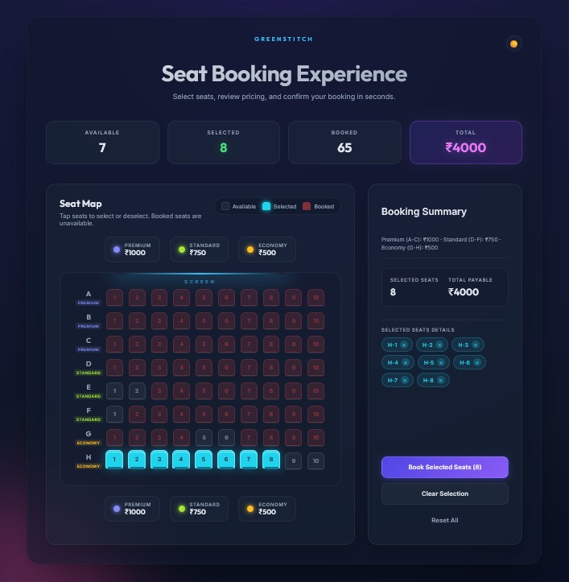

# GreenStitch Frontend Assessment – Seat Booking System

This project is my submission for the **GreenStitch Frontend Technical Assessment**, featuring a complete, modern, and fully functional **Seat Booking System** built using React.

---

## 🌗 UI Preview

### 🌞 Light Mode


### 🌙 Dark Mode



## 🚀 Features Implemented (All Required Features Completed)

### 🎯 Core Booking Logic
- 8×10 seat matrix with row-wise pricing tiers  
- Seat states: **Available**, **Selected**, **Booked**  
- Selection toggle with smooth interaction  
- Booked seats are locked and cannot be changed  

### 💰 Dynamic Pricing
- Premium (Rows A–C): ₹1000  
- Standard (Rows D–F): ₹750  
- Economy (Rows G–H): ₹500  
- Real‑time price calculation based on selected seats  

### 🧪 Required Validation Rules
- **Maximum 8 seats** per booking  
- **Continuity Rule enforced:**  
  No isolating a single available seat between two taken seats  
- Detailed error feedback for invalid actions  

### 🧾 Booking Confirmation Flow
- Confirmation modal shows total seats + price  
- Click Confirm → seats become booked permanently  
- Cancel → selection preserved  

### 💾 Persistence (As Required)
- Used `localStorage` to store booked seats  
- Booked seats stay even after refresh  

### 🧹 Clear & Reset Actions
- **Clear Selection** → Only removes selected seats  
- **Reset All** → Restores default state + clears localStorage  

---

## ✨ Extra Enhancements (Encouraged by Instructions)

- 🔄 Light/Dark theme toggle  
- 🎨 Premium UI with gradients, glassmorphism, shadows  
- 🪑 Smooth seat animations with pop effects  
- 🏷 Selected seat chips with remove button  
- ⚡ Faster, cleaner UX interactions  
- 📱 Fully responsive layout  
- 🧊 Category cards showing pricing tiers  

---

## 📁 Project Structure

```
src/
 ├── SeatBooking.js       # All seat logic + UI
 ├── SeatBooking.css      # Complete styling, animations, themes
 ├── App.js
 ├── index.js
 └── index.css
public/
.git/                     # Commit history included
VIDEO_LINK.txt            # Walkthrough video link
package.json
```

---

## ▶ How to Run the Project

```
npm install
npm start
```

Runs on: **http://localhost:3000**

---

## 🎥 Walkthrough Video  
The video explaining logic, rules, UI, persistence, and edge cases is available in:

```
VIDEO_LINK.txt
```

---

## 🙌 Final Notes

This submission includes:

- ✔ Complete required logic  
- ✔ All validation rules  
- ✔ Booking modal + persistence  
- ✔ Modern UI and UX improvements  
- ✔ Clean React code with helper functions  
- ✔ Full `.git` commit history  

Thank you for reviewing my assessment!  
